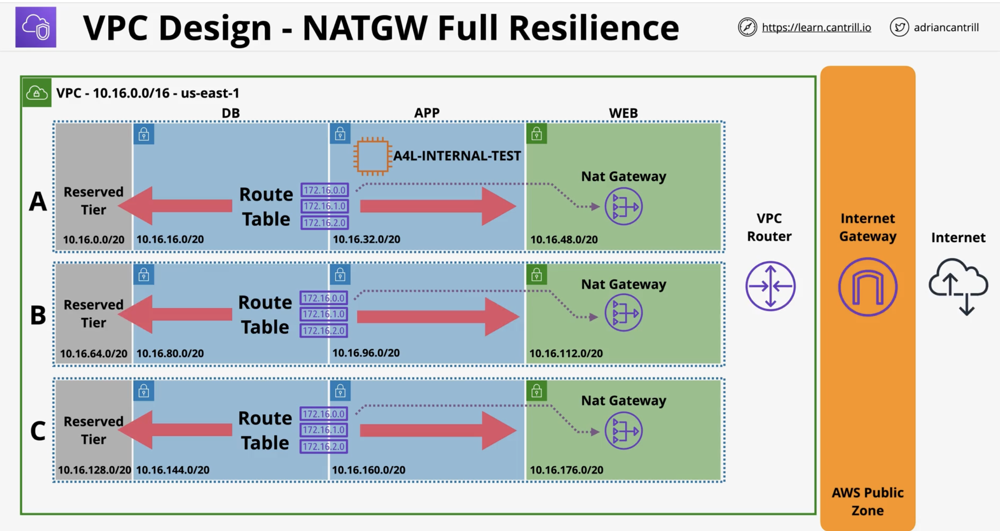

# Animals4Life Base VPC Template with Private Instance

This CloudFormation template creates an Amazon Virtual Private Cloud (VPC) with private subnet instances that can access the internet through a NAT gateway.

## Parameters

- `LatestAmiId`: the Amazon Machine Image (AMI) for the Bastion Host instance, default is the latest Amazon Linux 2 image.

## Resources

- `VPC`: the Amazon VPC with a CIDR block of 10.16.0.0/16.
- `IPv6CidrBlock`: an IPv6 CIDR block for the VPC.
- `InternetGateway`: an internet gateway for the VPC.
- `InternetGatewayAttachment`: attachment of the internet gateway to the VPC.
- `RouteTableWeb`: the route table for the public subnet that routes internet traffic to the internet gateway.
- `RouteTableWebDefaultIPv4`: default IPv4 route for the public subnet.
- `RouteTableWebDefaultIPv6`: default IPv6 route for the public subnet.
- `RouteTableAssociationWebA`: association of the public subnet A with the web route table.
- `RouteTableAssociationWebB`: association of the public subnet B with the web route table.
- `RouteTableAssociationWebC`: association of the public subnet C with the web route table.
- `SubnetReservedA`: a reserved subnet for future use.
- `SubnetReservedB`: a reserved subnet for future use.
- `SubnetReservedC`: a reserved subnet for future use.
- `SubnetDBA`: a private subnet with NAT gateway access to the internet.

## How to Use

1. Open the AWS CloudFormation console and create a new stack.
2. Select "Upload a template file" and upload this template file.
3. Enter the desired stack name and the LatestAmiId parameter.
4. Review the stack details and create the stack.
5. Wait for the stack creation to complete, then navigate to the VPC console to verify the VPC and subnet settings.

## Architecture Diagram

### Note

This template does not include the NAT gateway resource. To add a NAT gateway, create a new resource of type "AWS::EC2::NatGateway" and update the "SubnetDBA" resource with the NAT gateway ID.

